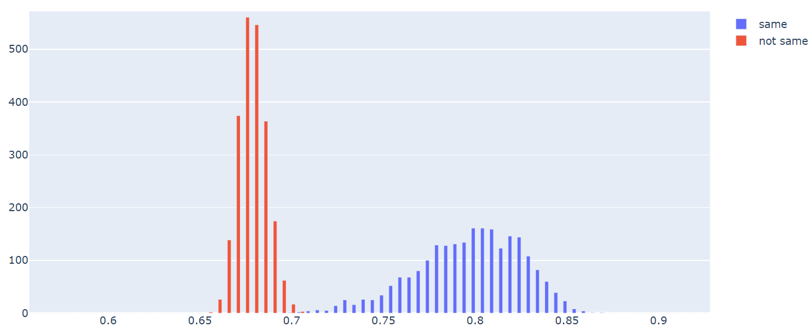

# Summary
MESH is a POC (Proof of Concept) of high accurate Iris Recognition algorithm. Tested on CASIA_V1 dataset with manual labeled pupil circular, the 1-on-1 cross matching accuracy is 100%. After rejecting several low quality images, the theoritical ERR (Equal Error Rate) can be as low as 1/1billion.

MESH: Histogram of Same/Not_Same Irises 

 

MESH_Open is part of MESH which was open sourced in this repository. MESH_Open has a cross matching accuracy of 99.9965%, or 10 errors in a total of 285,390 1-on-1 cross matchings.

MESH_Open: Histogram of Same/Not_Same Irises 

 

A main advantage of MESH is that the Same Iris Histogram and the Not Same Iris Histogram are far apart, well separated. Which indicates that Iris Recognition has the potential to achieve very high cross matching accuracy, e.g. 1/1billion.

# WorkFlow
## Iris Location
Manual labeled pupil circular data were used, because MESH focuses on feature matching, and I do not have a good Iris Location/Segmentation algorithm. Notes that the manual labeled pupil circulars are not accurate at all. I labelled it myself, sometimes there are 10 pixels offset from ground truth. With a good Iris Location algorithm MESH can do even better. 

 

The Iris circular is setup as same center of Pupil, radius 100 pixels.

## Normalization
Simply stretch the Iris circular disk to a rectangle.

## Encoding
Gabor Filter was used for Iris Encoding. Source code was borrowed from mvjq's repository 
https://github.com/mvjq/IrisRecognition.

## Template Matching
MESH focuses on Iris Template Matching. The main idea is to divides the normalized Iris Rectangles into small blocks, then calculates HD (Hamming Distance) between the small blocks. It is a flexible HD calculating algorithm, which can handle the distortion in Iris streching. As a result, MESH_Open achieves cross matching accuracy 99.9965%. MESH uses advanced algorithm and achieves accuracy 100%. 

## 1-On-1 Cross Matching
Each Iris was matched with all other Irises. Histogram of Same Iris and Not Same Iris were plotted together and compared.

Each Iris Matching takes about 0.12 seconds on Intel(R) Core(TM) i7-8565U CPU (single thread). It takes about 10 hours to run a full cross matching. One of the disadvantage of MESH Feature Matching is its speed.

# Q/A
## Why did you choose CASIA_V1?
CASIA_V1 was selected as the testing database because it is the most popular and well studied. CASIA_V1 also has images of relatively higher quality comparing with many other Iris datasets. MESH performs the best with high quality images. The clearer the iamges, the less occluded by eyelads, the higher accuracy it can be.

## Why did you use circular model for Iris/Pupil? 
It is well known that Iris Inner/Outer boundaries are not circular. Circular model was used mainly because it is a test of POC, and also because of the fact that MESH has a very robust Feature Matching algorithm, which works well with over simplified Iris Location data. Even with a simple circular model and a not so accuratly labelled data, MESH and MESH_Open still gets 100% and 99.9965% accuracy.

## Why did you manually label Pupil Location?
Iris Location is a huge topic. I tried to train a YOLO3 Deep Learning model to locate the Pupils in CASIA_V1, it works well, but needs more fine tune. Mean while, what makes MESH so accurate is its Feature Matching algorithm. So I simply manual labelled the Pupil location.

## Why didn't you use Iris outer circle?
In CASIA_V1, all irises radius are around 100 pixels. So the Iris circular is setup as same center of Pupil, radius 100 pixels. It is well known that Irises outer boundaries are not circular, and Irises center are usually not the same as Pupils center. But MESH Feature Maching algorithm is robust enough to handle it.

## Why didn't you detect eyelashes, eyelads and reflections?
Detecting eyelashes/eyelads/reflection in Iris images is a very difficult task. I don't have a good eyelashes/eyelads/reflection detection algorithm. But MESH Feature Maching algorithm is robust enough to handle it.

## Can I use my own good Iris Location/Segmentation algorithm, which detects Iris inner/outer boundaries (not circular), eyelashes, eyelads, and reflections? Would that improve MESH ERR?
A good Iris Location/Segmentation algorithm that detects Iris inner/outer fine boundaries, eyelashes, eyelads, and reflections can greatly improve MESH accuracy, that is almost for sure, at least it doesn't hurt.

## Can I use my own Iris Encoding method?
A good Template Encoding algorithm might also help. Gabor Filter parameters in this repository are far from fine tuned, I only tried 3~4 times before choose it. 

## How do I get MESH?
MESH is not published. If you are interested in adding MESH into your Iris Recognition algorithms portfolio, please contact kaiwangcanada@gmail.com.

# Python Implementation
Requirements:

Anaconda (https://www.anaconda.com/)

Opencv (conda install -c conda-forge opencv)

Plotly (conda install -c plotly plotly)
